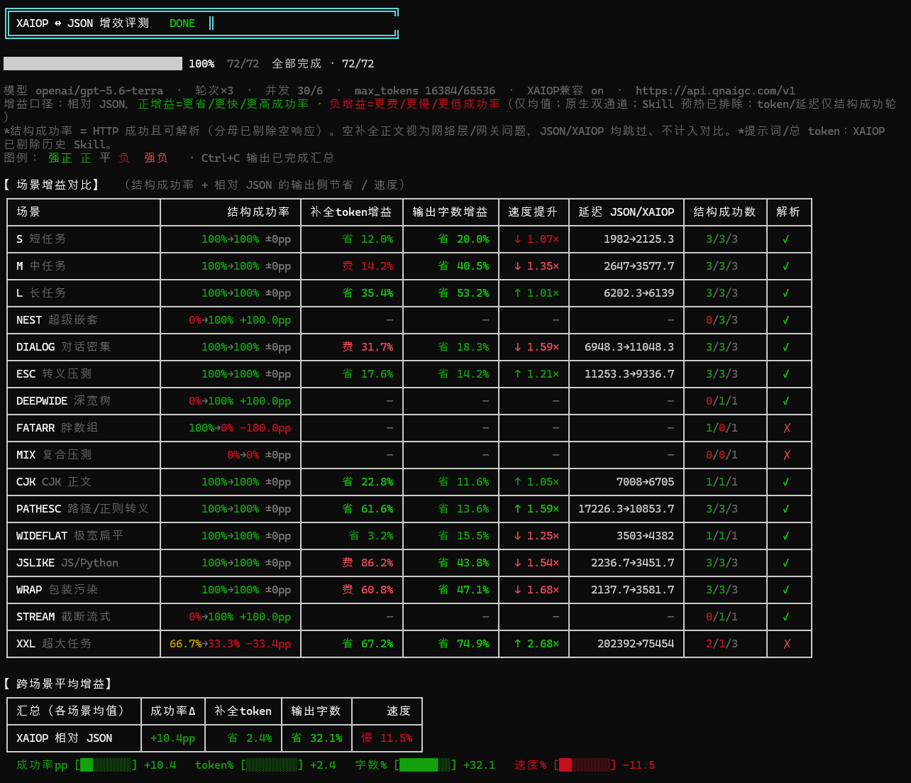
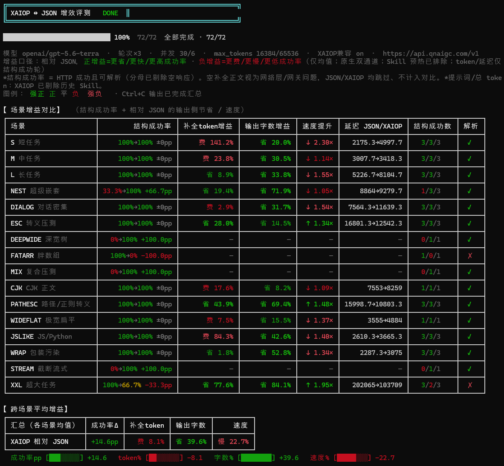
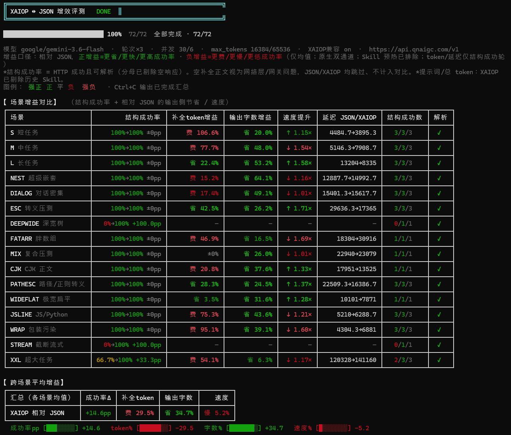
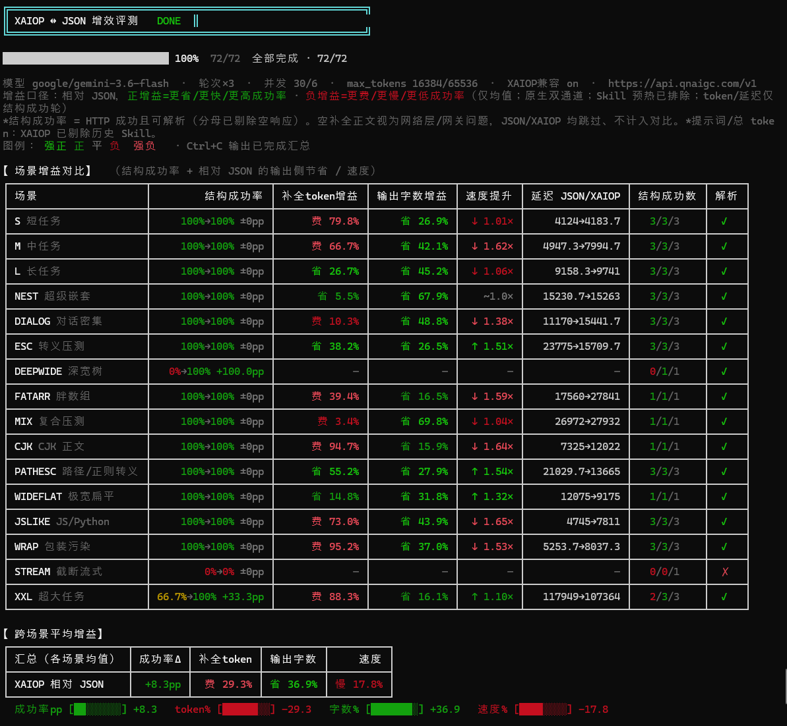

# XAIOP

<p align="center">
  
</p>

<p align="center">
  <strong>eXtensible AI Output Protocol</strong><br/>
  <sub>Models write lines. Programs parse them deterministically.</sub>
</p>

<p align="center">
  <a href="https://github.com/AboutUip/XAIOP"></a>
  <a href="LICENSE"></a>
  
  
  
</p>

<p align="center">
  <a href="README.md"></a>
  <a href="README.zh-CN.md"></a>
  <a href="docs/protocol/syntax.md"></a>
  <a href="docs/sdk/nodejs/"></a>
  <a href="docs/performance.md"></a>
</p>

---

<p align="center">
  
  
  
  
  
  
  
</p>

<p align="center">
  Not a service-to-service JSON replacement — the bridge from <em>generation</em> to <em>software</em>.
</p>

---

### The problem with JSON-shaped generation

Traditional JSON/XML ask the model for a finished, globally correct structure in one pass — a **memory** test of braces and depth. XAIOP asks for a sequence of cursor moves; the SDK materializes JSON. **Memory → logic.**

### What XAIOP changes

Structure is **line-oriented**. Position is a **cursor**. There is **no brace pairing**, no model-side hashing, and — by default — **no silent repair**. The wire stays honest.

Gains are **conditional** on the model’s JSON strength — not a universal replacement story.

→ [Positioning](docs/overview/positioning.md) · [Design principles](docs/overview/design-principles.md) · [Introduction](docs/overview/introduction.md)

---

### On the wire

```text
>
>meta
name:demo
version:1
.
>tags-
:alpha
:beta
.
>users-
>
id:1
name:alice
<
```

Materializes as:

```json
{
  "meta": { "name": "demo", "version": 1 },
  "tags": ["alpha", "beta"],
  "users": [{ "id": 1, "name": "alice" }]
}
```

[Syntax](docs/protocol/syntax.md) · [Full fixture](docs/examples/complex.xaiop) · [Node demo](demos/nodejs/)

---

### Paths

- **Grammar** — [docs/protocol/](docs/protocol/)
- **Node.js SDK** — [docs/sdk/nodejs/](docs/sdk/nodejs/) · [xaiop-sdk/nodejs/](xaiop-sdk/nodejs/)
- **Teach the model** — [classic Skill](skills/xaiop/SKILL.md) · [allowlist Skill](skills/xaiop-allowlist/SKILL.md)
- **Metrics package** — [JSON](docs/metrics/bench-metrics-gpt-gemini-compat-2026-08-02.json) · [guide](docs/metrics/bench-metrics-gpt-gemini-compat-2026-08-02.md)

Java and Python SDKs are pending update. English docs are authoritative; `*.zh-CN.md` mirrors ship throughout.

---

### Evidence

Native dual channel · no JSON→XAIOP translation · structure rate among non-empty completions  
Definitions: [docs/performance.md](docs/performance.md)

<p align="center">
  
  
  <br/>
  
  
  <br/>
  
  
  <br/>
  
  
</p>

<p align="center">
  
  
  <br/>
  <sub>Deep trees; JSON left braces unclosed — all four runs.</sub>
</p>

<table>
  <tr>
    <td width="50%" valign="top">
      <p align="center"><sub>GPT · allowlist · compatibility</sub></p>
      
    </td>
    <td width="50%" valign="top">
      <p align="center"><sub>GPT · classic · compatibility</sub></p>
      
    </td>
  </tr>
  <tr>
    <td width="50%" valign="top">
      <p align="center"><sub>Gemini · allowlist · compatibility</sub></p>
      
    </td>
    <td width="50%" valign="top">
      <p align="center"><sub>Gemini · classic · compatibility</sub></p>
      
    </td>
  </tr>
</table>

<p align="center">
  <sub>Additional screenshots (native mode, DeepSeek) → <a href="resources/">resources/</a></sub>
</p>

---

<p align="center">
  <a href="LICENSE"></a>
  
  <a href="docs/"></a>
</p>
